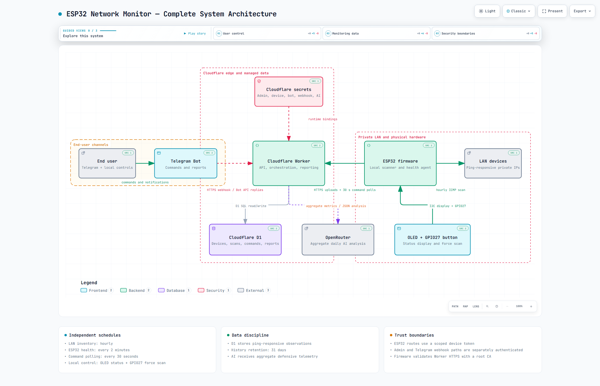

# ESP32 Network Monitor

An ESP32-based private-LAN availability monitor with a Cloudflare Worker, D1 history, Telegram control, OLED status, and optional OpenRouter daily analysis.

The ESP32 discovers its DHCP-assigned IPv4 subnet and performs the LAN scan locally. The Worker stores observations and coordinates commands; it does not attempt to scan through NAT from the public Internet.

## What it does

- Scans the local `/24` network once per hour.
- Stores only ping-responsive IP observations while retaining scan totals.
- Publishes lightweight ESP32 health every two minutes without starting a scan.
- Handles fresh `/status` and direct health requests through a 30-second command poll.
- Shows state, target, and next scan time on an SSD1306 OLED.
- Supports a GPIO27 force-scan button.
- Sends deterministic Telegram scan/status output.
- Generates exactly one automatic AI report only when a local day has at least two scans.
- Retains scan/report history for 31 days; cleanup runs after a successful upload.

## Architecture

[](docs/images/system-architecture.png)

_Diagram created with [Archify](https://github.com/tt-a1i/archify)._

_Click the diagram to open the full-resolution image._

Raw scan observations remain in D1. OpenRouter receives defensive aggregate metrics and online-observed device measurements; it does not control Telegram commands or scanning.

## Current cadence

| Activity | Interval | Starts a LAN scan? |
|---|---:|---:|
| Automatic LAN inventory | 1 hour | Yes |
| Automatic ESP32 health | 2 minutes | No |
| Worker command poll | 30 seconds | No |
| Daily report attempt | After 00:05 local time, retrying every 15 minutes until accepted | No |

The automatic health baseline is approximately 720 D1 device writes per day, or 21,600 per 30 days, plus state transitions and requested refreshes. The 30-second command polling schedule is unchanged.

## Quick start

Follow [Setup.md](Setup.md) from a fresh clone. It covers:

- Cloudflare D1 and Worker creation.
- Local per-installation secret generation.
- Telegram webhook registration.
- HTTPS root-CA validation on the ESP32.
- Arduino dependencies, wiring, and firmware upload.
- Direct health-latency measurement.
- Pre-publication secret scanning.

Windows setup begins with:

```powershell
Copy-Item .env.example .env
notepad .env
.\setup-user.bat
```

The setup script prepares configuration only. It does not deploy, upload firmware, or print generated secret values.

## Repository layout

```text
worker/                         Cloudflare Worker, D1 migrations, tests, scripts
esp32/NetworkMonitor/           Arduino firmware and safe configuration template
setup-user.bat                  Windows setup entry point
setup-user.ps1                  Per-installation configuration generator
Setup.md                        Complete installation and verification guide
Secrets.md                      Credential storage and rotation guide
```

Generated `.env.local`, `worker/.dev.vars`, `worker/wrangler.jsonc`, ESP32 `config.h`, certificates, keys, and database backups are ignored and must never be committed.

## Reporting rules

- Zero scans: a no-activity message is produced without AI.
- One scan: an insufficient-data message is produced without AI.
- Two or more scans: one automatic AI report uses every scan for that local date.
- Manual and retry scans are included; 24 scans is not a limit.
- Offline probe addresses are not treated as devices, unstable hosts, or high-latency hosts.

## Network limitations

A failed ping is an observation, not proof that a device is powered off.

- Host firewalls may block ICMP.
- Phones may sleep or ignore pings while idle.
- Guest Wi-Fi, VLANs, and client isolation can prevent peer communication.
- Private/randomized addressing can make one physical device appear under changing IPs.
- Latency exists only for successful ping replies.

Keep firewall changes limited to trusted private profiles and the smallest required source range. This project intentionally does not implement Wake-on-LAN, router changes, or device power control.

## Security

Read [Secrets.md](Secrets.md) before deployment or publication. Production secrets belong in Cloudflare Worker secrets, while local credentials remain in ignored files. Firmware uses a scoped ESP32 token and validates HTTPS with a configured root CA; it does not use `setInsecure()`.

If any real credential appears in a tracked file, commit, issue, screenshot, or log, rotate it before continuing. See [SECURITY.md](SECURITY.md) for responsible reporting.

## License

No open-source license has been granted yet. Public visibility allows the code to be reviewed, but does not grant additional reuse, modification, or redistribution rights beyond applicable law and GitHub's terms. Add an explicit license in a later release if broader reuse is intended.

## Development checks

```powershell
Set-Location worker
npm.cmd install
npm.cmd run typecheck
npm.cmd test
npx.cmd wrangler deploy --dry-run
```

The example Wrangler configuration intentionally contains placeholders. Validation and deployment use the ignored `worker/wrangler.jsonc` generated for one installation.
